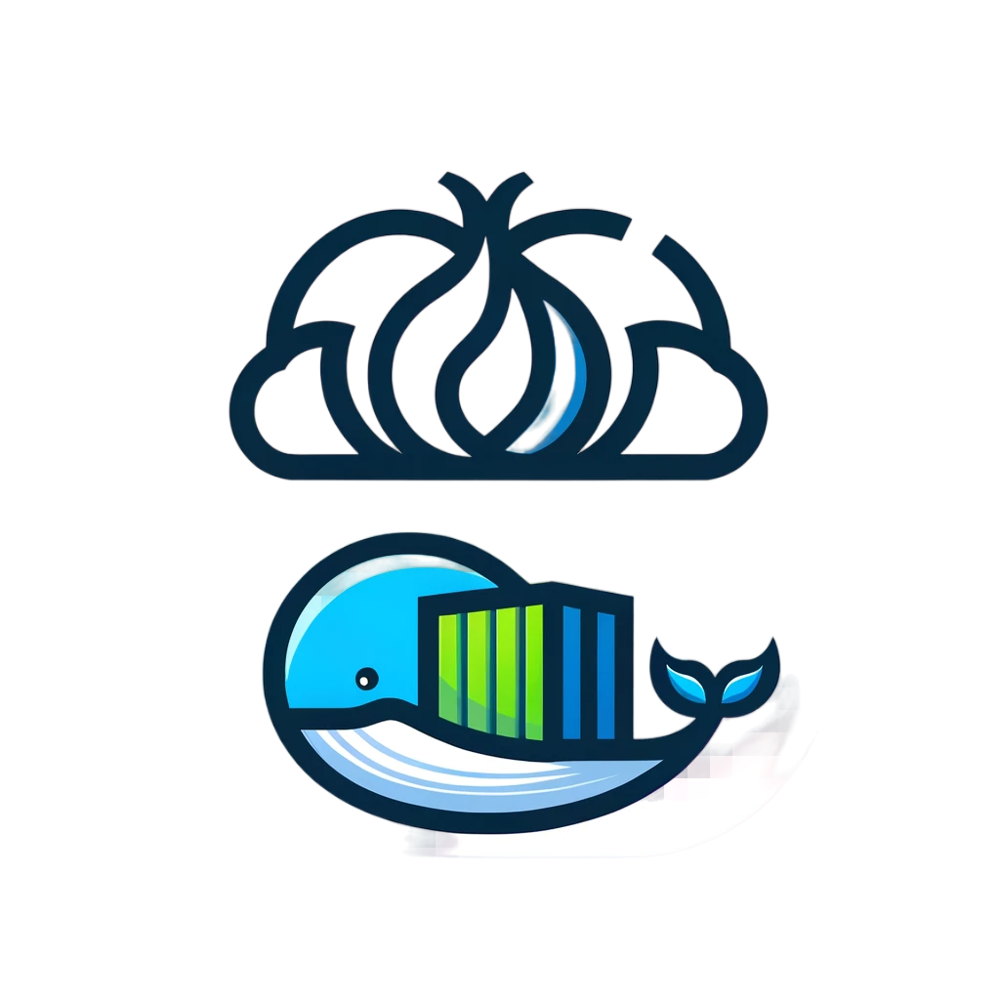

 
  

<h1 align="center"> 
    CloudCapsule 
</h1>
<h3 align="center"> 
    Streamlined Docker Hosting for Web Applications 
</h3>

 

## Table of Contents 

- [Overview](#overview)
  - [Key Features](#key-features)
  - [Technology Stack](#technology-stack)
- [Getting Started](#getting-started)
- [Privacy Policy](#privacy-policy)
- [Contributing](#contributing)

## Overview 

CloudCapsule is a versatile Docker solution designed to simplify the process of setting up and managing web hosting environments. It supports a wide range of technologies including PHP, NodeJS, and Python3, and is optimized for both clearnet and Tor networks. With CloudCapsule, you can focus on developing your web applications without worrying about the complexities of server management.

### Key Features 

- **Ease of Setup**: Automate server building with just three commands.
- **Diverse Technology Support**: Native compatibility with PHP, NodeJS, Python3, and more.
- **Containerized System**: Utilizes Kubernetes and advanced DevOps techniques for robust hosting.
- **Full-Featured VPS**: Includes file manager, web-based SSH, MySQL, PHP7, Python3, Golang, Git, and Ruby.
- **Privacy Focused**: Minimal personal data collection and strict adherence to privacy policies.

### Technology Stack 

- Primary Languages: Python (89.5%), PHP (5.4%), CSS (2.0%), C (1.6%), JavaScript (1.2%), Shell (0.1%)
- Framework: Flask
- Containerization: Docker, Kubernetes
- Cloud Integration: CloudFlare

[ <a href="#table-of-contents">↑ Back to top ↑</a> ]

## Getting Started 

To begin using CloudCapsule for your web hosting needs, follow these simple steps:

1. Clone the CloudCapsule repository.
2. Run the setup commands (detailed in the installation guide).
3. Customize your environment as needed.

[ <a href="#table-of-contents">↑ Back to top ↑</a> ]

## Privacy Policy 

At CloudCapsule, we value your privacy. We only investigate servers if there is a unique report. No personal details are collected, and users have the option to request servers anonymously through Sonar. We encourage users to explore encryption options for storing and sharing personal information.

[ <a href="#table-of-contents">↑ Back to top ↑</a> ]

## Contributing 

Contributions to CloudCapsule are welcome! If you have ideas for improvements or want to help enhance the project, please check our contributing guidelines.

[ <a href="#table-of-contents">↑ Back to top ↑</a> ]

